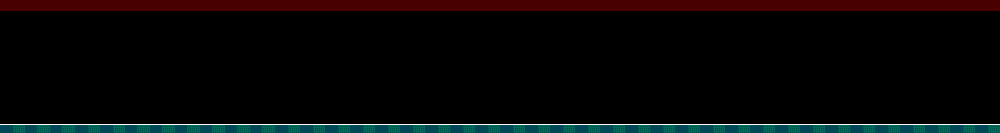

sample.mov is a prores file at yuv422p10le which includes samples that are outside of broadcast range (notable values from 940-1023)

This command makes a gif of sample.mov with a waveform filter with a red transparent box covering the out-of-broadcast range section.
```
ffmpeg -i sample.mov -vf "waveform,drawbox=y=(ih-(16*(ih/256))):w=iw:h=16*(ih/256):color=aqua@0.3:t=16*(ih/256),drawbox=w=iw:h=ih-(235*(ih/256)):color=crimson@0.3:t=16*(ih/256)" sample.gif
```


This command encodes the input with lossless ffv1 with lut to clip out-of-broadcast values and then pipes it into another instance of ffmpeg to make a waveform gif as before. In the result there is no sample in the out-of-broadcast range.
```
ffmpeg -report -i sample.mov -vf lut=y=clipval:u=clipval:v=clipval -c:v ffv1 -f nut - | ffmpeg -i - -vf "waveform,drawbox=y=(ih-(16*(ih/256))):w=iw:h=16*(ih/256):color=aqua@0.3:t=16*(ih/256),drawbox=w=iw:h=ih-(235*(ih/256)):color=crimson@0.3:t=16*(ih/256)" sample_encoded_as_ffv1.gif
```


This command encodes the input with mpeg2 with lut to clip out-of-broadcast values and then pipes it into another instance of ffmpeg to make a waveform gif as before. Here there are details again in the out-of-broadcast range
```
ffmpeg -report -i sample.mov -vf lut=y=clipval:u=clipval:v=clipval -c:v mpeg2video -f nut - | ffmpeg -i - -vf "waveform,drawbox=y=(ih-(16*(ih/256))):w=iw:h=16*(ih/256):color=aqua@0.3:t=16*(ih/256),drawbox=w=iw:h=ih-(235*(ih/256)):color=crimson@0.3:t=16*(ih/256)" sample_encoded_as_mpeg2video.gif
```


Because the last output is 8 bit, I here use the scale command to make the output waveform to be the same size as the others.

```
ffmpeg -report -i sample.mov -vf lut=y=clipval:u=clipval:v=clipval -c:v mpeg2video -f nut - | ffmpeg -i - -vf "waveform,drawbox=y=(ih-(16*(ih/256))):w=iw:h=16*(ih/256):color=aqua@0.3:t=16*(ih/256),drawbox=w=iw:h=ih-(235*(ih/256)):color=crimson@0.3:t=16*(ih/256),scale=iw:ih*4" sample_encoded_as_mpeg2video_scaled.gif
```

